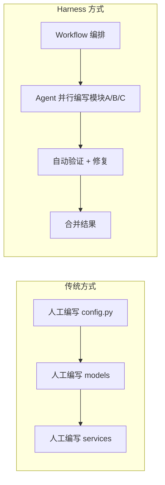

# AI Agent 数据分析平台 — Harness 工程实现方案

> 基于 Claude Code Workflow/Agent 系统的多智能体工程实施指南
> 关联文档：[需求文档](./AI_Agent数据分析平台_需求文档.md) · [架构设计文档](./AI_Agent数据分析平台_架构设计文档.md)

---

## 1. 什么是 Harness 工程

Harness 工程是指利用 Claude Code 的 **Workflow（工作流）** 和 **Agent（智能体）** 系统，将项目实现拆解为多个并行的、可复现的自动化任务，由多个 AI Agent 协作完成代码编写的一种工程方法。

### 1.1 核心工具

| 工具 | 用途 | 在本项目中的应用 |
|------|------|------------------|
| **Workflow** | 多智能体编排脚本，确定性控制流 | 定义各 Phase 的并行任务、依赖顺序、验证步骤 |
| **Agent** | 独立的 AI 执行单元 | 每个模块（如 config.py / models / tools）由一个 Agent 独立编写 |
| **pipeline()** | 串行处理管道，无屏障并行 | 将多个模块按依赖顺序编排，后一阶段不需等待全部完成 |
| **parallel()** | 有屏障的并发执行 | 无依赖的模块（如多个 models）同时生成 |
| **isolation: worktree** | 隔离工作区 | 高风险改动（如 Alembic 迁移）在独立 worktree 中进行 |

### 1.2 与传统开发的区别



---

## 2. 总体工作流架构

### 2.1 项目实现的 6 个 Workflow

| Workflow | 对应 Phase | 触发条件 | Agent 数量 | 预计调用量 |
|----------|-----------|----------|-----------|-----------|
| `wf-core-setup` | Phase 1 基础设施 | 首个 Workflow | 5-8 个 Agent | ~50k tokens |
| `wf-data-layer` | Phase 2 数据层 | core 完成 | 8-12 个 Agent | ~80k tokens |
| `wf-tools` | Phase 2/3 工具层 | data 完成 | 10-15 个 Agent | ~120k tokens |
| `wf-services-api` | Phase 3 服务+API | tools 完成 | 8-10 个 Agent | ~100k tokens |
| `wf-agent-engine` | Phase 4 Agent 引擎 | services 完成 | 10-15 个 Agent | ~150k tokens |
| `wf-frontend` | Phase 5 前端开发 | API 稳定 | 15-20 个 Agent | ~200k tokens |

### 2.2 Workflow 依赖关系

```
wf-core-setup
    │
    ▼
wf-data-layer
    │
    ▼
wf-tools ───────────────┐
    │                   │
    ▼                   ▼
wf-services-api    wf-agent-engine (先于 services 启动分析设计)
    │                   │
    └───────┬───────────┘
            ▼
      wf-frontend (API 稳定后启动)
```

---

## 3. Workflow 脚本设计

### 3.1 范式模板：标准模块编写

每个模块的编写都遵循以下 Harness 模式：

```javascript
// 范式：编写一个后端模块
export const meta = {
  name: 'write-module',
  description: '编写一个后端 Python 模块',
  phases: [
    { title: 'Scaffold', detail: '读取上下文和模板' },
    { title: 'Write', detail: 'Agent 编写代码' },
    { title: 'Verify', detail: '验证代码正确性' },
  ],
}

// 1. 读取上下文（接口定义、依赖模块、架构约束）
const context = await agent('读取相关接口定义和架构文档', {
  label: 'Read Context',
  schema: CONTEXT_SCHEMA,
})

// 2. 编写代码（Agent 生成完整模块代码）
const code = await agent(`编写 ${module_name} 模块`, {
  label: `Write ${module_name}`,
  schema: CODE_SCHEMA,
})

// 3. 验证（语法检查 + 导入测试）
const verified = await agent(`验证 ${module_name}`, {
  label: `Verify ${module_name}`,
  schema: VERIFY_SCHEMA,
})
```

### 3.2 wf-core-setup：基础设施核心

```javascript
export const meta = {
  name: 'wf-core-setup',
  description: 'Phase 1: 搭建基础设施核心（config/database/models/schemas）',
  phases: [
    { title: 'Config Layer', detail: '配置 + 异常 + 日志' },
    { title: 'Database Layer', detail: '数据库引擎 + ORM 模型' },
    { title: 'Schema Layer', detail: 'Pydantic 请求/响应模型' },
    { title: 'Migrate', detail: 'Alembic 自动迁移' },
    { title: 'Verify', detail: '启动验证' },
  ],
}

phase('Config Layer')

// ── Task 1: 并行编写 config + exceptions + logger ──
const configResults = await pipeline(
  [
    { module: 'config', file: 'core/config.py', deps: [] },
    { module: 'exceptions', file: 'core/exceptions.py', deps: [] },
  ],
  // Stage 1: 每个 Agent 独立编写
  (t) => agent(`完整编写 backend/app/core/${t.file}，参考架构设计文档中该模块的规格`, {
    label: `write:${t.module}`,
    schema: FILE_WRITE_SCHEMA,
  }),
  // Stage 2: 验证每个文件
  (code, task) => agent(
    `验证以下 ${task.module} 代码语法正确、类型标注完整、可导入`,
    { label: `verify:${task.module}`, schema: VERIFY_SCHEMA }
  )
)

// ── Task 2: 编写 database.py（依赖 config）──
const databaseFile = await agent('编写 backend/app/core/database.py，使用 asyncpg + SQLAlchemy 异步引擎', {
  label: 'write:database',
  schema: FILE_WRITE_SCHEMA,
})

phase('Database Layer')

// ── Task 3: 并行编写所有 ORM 模型（10 张表）──
const models = ['base', 'dataset', 'file', 'column_schema', 'task',
                'checkpoint', 'chart', 'report', 'chat_message',
                'agent_execution', 'tool_log']
const modelResults = await pipeline(
  models,
  (name) => agent(`编写 backend/app/models/${name}.py 的 SQLAlchemy ORM 模型`, {
    label: `model:${name}`,
    schema: FILE_WRITE_SCHEMA,
  }),
  (code, name) => agent(`验证 model ${name} 语法和字段完整性`, {
    label: `verify:${name}`,
    schema: VERIFY_SCHEMA,
  })
)

phase('Schema Layer')

// ── Task 4: 并行编写所有 Pydantic Schema ──
const schemas = ['common', 'file', 'dataset', 'task', 'chat', 'report', 'system']
const schemaResults = await pipeline(
  schemas,
  (name) => agent(`编写 backend/app/schemas/${name}.py Pydantic v2 Schema`, {
    label: `schema:${name}`,
    schema: FILE_WRITE_SCHEMA,
  }),
  (code, name) => agent(`验证 schema ${name} 的字段定义`, {
    label: `verify:${name}`,
    schema: VERIFY_SCHEMA,
  })
)

phase('Migrate')

// ── Task 5: Alembic 自动生成迁移 ──
await agent('配置 Alembic 并生成初始迁移版本', {
  label: 'alembic migrate',
  isolation: 'worktree',
})

phase('Verify')

// ── Task 6: 启动验证 ──
await agent('验证 FastAPI 能否启动，/health 端点是否返回正常', {
  label: 'boot verify',
})
```

### 3.3 wf-tools：工具层（关键 Workflow）

这是最核心的 Workflow，因为 Tool 是纯逻辑模块，不涉及 LLM，适合并行编写。

```javascript
export const meta = {
  name: 'wf-tools',
  description: 'Phase 2: 编写所有 Tool 工具模块',
  phases: [
    { title: 'Base Tool', detail: '基类定义' },
    { title: 'Tools', detail: '7 个 Tool 并行编写' },
    { title: 'Verify', detail: '单元测试验证' },
  ],
}

phase('Base Tool')
const baseTool = await agent('编写 backend/app/tools/base.py BaseTool 抽象基类', {
  label: 'base tool',
  schema: FILE_WRITE_SCHEMA,
})

phase('Tools')
// 所有 Tool 可以并行编写（依赖已在 base 中定义）
const toolDefs = [
  { file: 'file_tool.py', prompt: 'FileTool: 文件读写/采样/筛选/MD5 工具' },
  { file: 'parse_tool.py', prompt: 'ParseTool: Excel/CSV/JSON 解析，自动检测编码和分隔符' },
  { file: 'stats_tool.py', prompt: 'StatsTool: 描述统计/频次/趋势/相关性/异常检测，使用 Polars' },
  { file: 'plotly_tool.py', prompt: 'PlotlyTool: 7 种图表类型生成（bar/line/scatter/pie/histogram/box/heatmap）' },
  { file: 'chart_recommend_tool.py', prompt: 'ChartRecommendTool: 基于字段特征推荐图表类型（LLM 轻量调用）' },
  { file: 'python_exec_tool.py', prompt: 'PythonExecTool: RestrictedPython 沙箱执行 LLM 生成的代码' },
  { file: 'export_tool.py', prompt: 'ExportTool: 报告导出为 HTML/Markdown 格式' },
  { file: 'rag_search_tool.py', prompt: 'RAGSearchTool: 第二阶段预留 Stub' },
]

const toolResults = await pipeline(
  toolDefs,
  (t) => agent(`${t.prompt}，参考架构设计中该 Tool 的接口定义`, {
    label: `write:${t.file.replace('.py','')}`,
    schema: FILE_WRITE_SCHEMA,
  }),
  (code, t) => agent(`验证 ${t.file} 语法、类型标注、接口完整性`, {
    label: `verify:${t.file.replace('.py','')}`,
    schema: VERIFY_SCHEMA,
  })
)

phase('Verify')
// 对每个 Tool 生成测试文件（并行）
const testResults = await parallel(toolDefs.map(t => () =>
  agent(`为 backend/app/tools/${t.file} 编写 pytest 单元测试`, {
    label: `test:${t.file.replace('.py','')}`,
    schema: TEST_SCHEMA,
  })
))
```

### 3.4 wf-agent-engine：Agent 编排（最复杂）

```javascript
export const meta = {
  name: 'wf-agent-engine',
  description: 'Phase 3-4: LangGraph 图 + Agent + Prompt 实现',
  phases: [
    { title: 'Graph', detail: 'State/Builder/Nodes/Routers' },
    { title: 'Prompts', detail: '4 个 Agent 的 Prompt 设计' },
    { title: 'Agents', detail: '4 个 Agent 实现（按依赖顺序）' },
    { title: 'Integration', detail: '连接 Service 层' },
  ],
}

phase('Graph')
// ── 先实现纯逻辑的 Graph 层（无 LLM 调用）──
const graphModules = await pipeline(
  [
    { file: 'state.py', prompt: 'AnalysisState TypedDict，含所有 Agent 共享状态字段' },
    { file: 'checkpointer.py', prompt: 'PostgresSaver Checkpoint 配置' },
    { file: 'routers.py', prompt: 'schema_router/chat_router 条件路由函数' },
  ],
  (m) => agent(`编写 backend/app/graph/${m.file}，${m.prompt}`, {
    label: `graph:${m.file.replace('.py','')}`,
    schema: FILE_WRITE_SCHEMA,
  })
)

phase('Agents')
// ── Ingestion Agent（依赖 ParseTool + FileTool）──
const ingestion = await agent('编写 Data Ingestion Agent，包含 Schema 推断和 Human-in-Loop 断点', {
  label: 'agent:ingestion',
  schema: FILE_WRITE_SCHEMA,
})

// ── Profiler Agent（依赖 StatsTool）──
const profiler = await agent('编写 Data Profiler Agent，包含质量分析和统计计划', {
  label: 'agent:profiler',
  schema: FILE_WRITE_SCHEMA,
})

// ── Analysis Agent（依赖 ChartRecommend + Plotly + PythonExec）──
const analysis = await agent('编写 Analysis Agent，包含图表推荐/生成/降级和报告撰写', {
  label: 'agent:analysis',
  schema: FILE_WRITE_SCHEMA,
})

phase('Integration')
// ── nodes + builder ──
const nodes = await agent('编写 graph/nodes.py，将 4 个 Agent 包装为 LangGraph Node 函数', {
  label: 'graph:nodes',
  schema: FILE_WRITE_SCHEMA,
})

const builder = await agent('编写 graph/builder.py，构建 LangGraph 状态图并编译', {
  label: 'graph:builder',
  schema: FILE_WRITE_SCHEMA,
})

// ── Chat Agent（依赖所有 Tool）──
const chat = await agent('编写 Chat Agent，包含多轮对话、意图分类、SSE 流式输出', {
  label: 'agent:chat',
  schema: FILE_WRITE_SCHEMA,
})
```

---

## 4. Agent 设计模式

### 4.1 三种 Agent 类型

| 类型 | 适用场景 | 输入 | 输出 | 温度 |
|------|----------|------|------|------|
| **Writer Agent** | 编写完整模块代码 | 架构规格 + 接口定义 + 上下文 | 完整文件内容 | 0.1 |
| **Reviewer Agent** | 验证代码正确性 | 代码 + 规范 | 通过/失败 + 修复建议 | 0.0 |
| **Test Agent** | 生成测试用例 | 模块代码 + 接口定义 | pytest 测试文件 | 0.2 |

### 4.2 Schema 驱动（结构化输出）

所有 Agent 调用都应使用 `schema` 参数来确保输出可解析：

```javascript
// 文件编写 Schema
const FILE_WRITE_SCHEMA = {
  type: 'object',
  properties: {
    file_path: { type: 'string', description: '文件相对路径' },
    content: { type: 'string', description: '完整文件内容' },
    summary: { type: 'string', description: '实现要点说明' },
  },
  required: ['file_path', 'content'],
}

// 验证 Schema
const VERIFY_SCHEMA = {
  type: 'object',
  properties: {
    passed: { type: 'boolean' },
    issues: { type: 'array', items: { type: 'string' } },
    suggestions: { type: 'array', items: { type: 'string' } },
  },
  required: ['passed', 'issues'],
}
```

### 4.3 质量保障：Adversarial Verify

对关键模块（Agent、Graph）使用对抗验证：

```javascript
// 对 Analysis Agent 进行 3 路对抗验证
const votes = await parallel([
  () => agent(`从"正确性"角度审查 Analysis Agent 代码，找出 BUG`, {
    label: 'review:correctness', schema: REVIEW_SCHEMA }),
  () => agent(`从"安全性"角度审查 Analysis Agent 代码，找安全漏洞`, {
    label: 'review:security', schema: REVIEW_SCHEMA }),
  () => agent(`从"可维护性"角度审查 Analysis Agent 代码，找设计问题`, {
    label: 'review:maintainability', schema: REVIEW_SCHEMA }),
])
// 如果 ≥2 个审查者发现问题，标记为不通过
const criticalIssues = votes.filter(v => v && v.issues.length > 1)
```

---

## 5. Pipeline 执行计划

### 5.1 完整执行流水线

```javascript
// 主调度 Workflow
export const meta = {
  name: 'wf-full-implementation',
  description: '全项目实现主调度，按阶段串行执行子 Workflow',
  phases: [
    { title: 'Phase 1', detail: '基础设施' },
    { title: 'Phase 2', detail: '数据层' },
    { title: 'Phase 3', detail: '工具层' },
    { title: 'Phase 4', detail: '服务与 API' },
    { title: 'Phase 5', detail: 'Agent 引擎' },
    { title: 'Phase 6', detail: '前端开发' },
    { title: 'Phase 7', detail: '集成优化' },
  ],
}

phase('Phase 1')
await workflow('wf-core-setup')

phase('Phase 2')
await workflow('wf-data-layer')

phase('Phase 3')
await workflow('wf-tools')

phase('Phase 4')
await workflow('wf-services-api')

phase('Phase 5')
await workflow('wf-agent-engine')

phase('Phase 6')
await workflow('wf-frontend')

phase('Phase 7')
// 集成测试 + MCP + 优化
await parallel([
  () => workflow('wf-mcp-integration'),
  () => workflow('wf-e2e-testing'),
  () => workflow('wf-docker-finalize'),
])
```

### 5.2 Agent 调用量预算估算

| 阶段 | Agent 数 | tokens/Agent | 总计 | budget 指令 |
|------|----------|-------------|------|-------------|
| wf-core-setup | 20-30 | ~2k | ~50k | `+50k` |
| wf-data-layer | 15-20 | ~3k | ~60k | `+60k` |
| wf-tools | 25-35 | ~3k | ~100k | `+100k` |
| wf-services-api | 20-25 | ~4k | ~100k | `+100k` |
| wf-agent-engine | 30-40 | ~4k | ~150k | `+150k` |
| wf-frontend | 30-40 | ~5k | ~200k | `+200k` |
| 集成优化 | 15-20 | ~3k | ~60k | `+60k` |

**总预算**: ~720k tokens

---

## 6. 实际执行步骤

### 6.1 启动一个 Phrase 的 Workflow

以 Phase 1（基础设施）为例，实际执行命令：

```
# 在 Claude Code 中执行：
/workflow wf-core-setup
```

或直接调用 Workflow 工具：

```
Workflow({ name: 'wf-core-setup' })
```

### 6.2 单模块编写（不启动整个 Workflow）

当只需要编写一个特定模块时：

```
# 直接使用 Agent 工具
Agent({
  prompt: '编写 backend/app/core/config.py，参考 docs/架构设计文档.md 中的配置项定义',
  subagent_type: 'general-purpose'
})
```

### 6.3 代码修改

当需要对已生成的代码进行修改时，使用 Edit 工具：

```
# 读取 → 编辑 → 验证
Read('backend/app/core/config.py')
Edit({ file_path, old_string, new_string })
```

---

## 7. 使用清单

### 7.1 每个 Workflow 开始前

- [ ] 读取对应的架构文档章节（docs/ 目录下）
- [ ] 确认前置 Workflow 已完成
- [ ] 确认 ADVP 虚拟环境已激活
- [ ] 确认远程仓库已同步

### 7.2 每个 Agent 调用前

- [ ] 是否有可复用的已有代码？
- [ ] 是否定义了完整的输入/输出 Schema？
- [ ] 是否需要 isolation: worktree？
- [ ] 是否需要并行执行（parallel）？

### 7.3 每个阶段完成后

- [ ] git add + git commit + git push
- [ ] 验证代码可导入/可运行
- [ ] 更新记忆文件记录关键决策

---

## 8. 最佳实践

### 8.1 代码质量

```javascript
// 每个模块写完后立即验证
const code = await agent('编写模块', { schema: FILE_WRITE_SCHEMA })
const review = await agent('审查代码', { schema: REVIEW_SCHEMA })
if (review.issues.length > 0) {
  // 自动修复
  const fixed = await agent(`修复以下问题:\n${review.issues.join('\n')}`, {
    schema: FILE_WRITE_SCHEMA,
  })
}
```

### 8.2 复杂修改使用 Worktree

```javascript
// 涉及数据库迁移或大量修改时使用 isolation
await agent('更新数据库模型并生成迁移', {
  isolation: 'worktree',
})
```

### 8.3 预算控制

```javascript
// 使用 budget 控制动态循环
while (budget.total && budget.remaining() > 20_000) {
  // 继续生成模块
}
```

### 8.4 记忆驱动

```javascript
// 关键决策记入记忆文件
writeMemory('project', '数据库选择了 asyncpg 而非 psycopg', {
  why: '架构设计文档指定 asyncpg',
  how: '在 core/database.py 中配置 asyncpg 连接',
})
```

---

## 附录：Workflow 脚本存放位置

```
.claude/workflows/
├── wf-core-setup.js        # Phase 1 基础设施
├── wf-data-layer.js        # Phase 2 数据层
├── wf-tools.js             # Phase 2/3 工具层
├── wf-services-api.js      # Phase 3 服务+API
├── wf-agent-engine.js      # Phase 4 Agent 引擎
├── wf-frontend.js          # Phase 5 前端
├── wf-mcp-integration.js   # MCP 集成
└── wf-full-implementation.js # 主调度
```

> **注**：Workflow 脚本在 `.claude/workflows/` 目录下，Claude Code 会在启动时自动加载。通过 `Workflow({ name: 'wf-core-setup' })` 或直接按名称引用即可调用。

---

> **文档版本记录**
>
> | 版本 | 日期 | 修改人 | 修改内容 |
> |------|------|--------|----------|
> | v1.0 | 2026-07-05 | AI | 初稿 |
